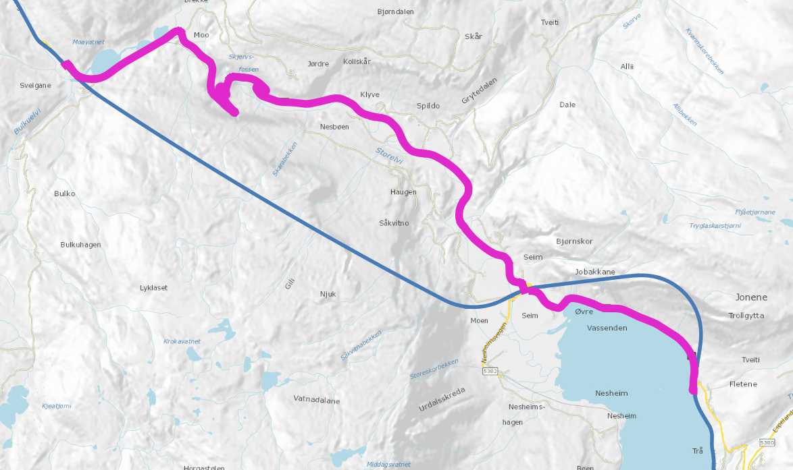
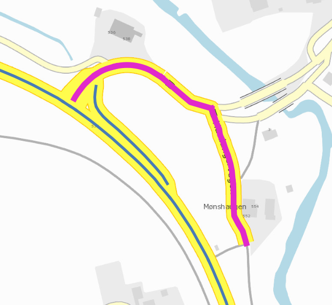

# ESA rapportering per riksvegrute

Rapporten `riksveglengder.xlsx` er laget ved å laste ned vegnett pluss objekttypen 595 Motorveg fra NVDB API LES, littegrann filtrering og kvalitetssjekk før vi summerer veglengder per riksvegrute og per motorvegtype. 

Datagrunnlaget er lagt ved i zip-arkivet `esarapport_kartgrunnlag.zip`. Som dataformat har vi valgt [geopackage](https://www.geopackage.org/), et moderne kartformat som støttes av alle moderne kartsystem og de fleste analysebibliotek. 

Via arbeidet har vi avdekket en del utfordringer med dataforvaltning av riksvegruter for "gammelt vegnett", og hvilke følger dette får for rapportering. For eksempel har vi en svært treg forvaltningsprosess og politisk prosess når forvaltningsansvaret skal overføres til andre vegmyndigheter. Veger som helt opplagt skal være for eksempel fylkeskommunen sitt ansvar kan bli liggende som europaveg eller riksveg i årevis. P.t. har vi cirka 70 slike strekninger beskrevet i objekttypen "Vegmyndighet kan bli endret". [Datakatalog-definisjon](https://datakatalogen.vegdata.no/922-Vegmyndighet%20kan%20bli%20endret) [Vegkart-søk](https://vegkart.atlas.vegvesen.no/#kartlag:geodata/@796291,7078174,3/hva:!(id~922)~/hvor:(vegsystemreferanse~!E~R)~)

Uavhengig av hvem som bør være vegmyndighet: Når vi har bygget en ny vegtrasé - skal gammelveien fremdeles være beskrevet som en "riksvegrute"? I kartbildet under så går den nye Rv13 - traséen forbi Øvre Vassenden i to tunneller (blå linje). Den gamle vegen (lilla linje) kan brukes som omkjøringsveg når tunnellene stenges, så her har vi gode argumenter for at gamlevegen er med i datasettet. [Se strekningen på vegkart](https://vegkart.atlas.vegvesen.no/#kartlag:geodata/@46418,6743361,11)

Litt lengre nord på Rv 13 (RV13 S35D1 m3327) har vi denne kryssløsningen, hvor gammel Rv13-trasé henger igjen på en ganske snål måte. [Se på vegkart](https://vegkart.atlas.vegvesen.no/#kartlag:geodata/@37251,6751284,16)

Slike spørsmål er det ikke tatt hensyn til i rapporten. 