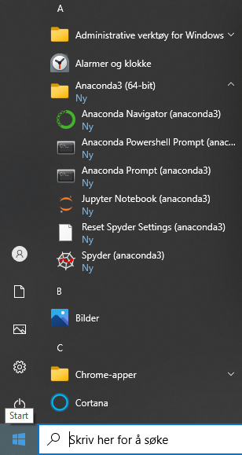
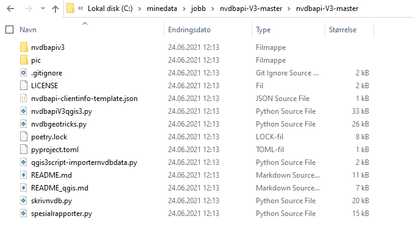

# Forslag - studieoppgave sommer 2021 for dem som vil

Siden jeg ikke kan veilede underveis er dette en relativt krevende oppgave. Det er mye programvare og kodespråk som er nytt. 

> Husk at hvert eneste punkt har sin brukerterskel. Dette kan være enkelt for noen, vanskelig for andre. 

# Installasjon og konfigurering

På PC der dere har admin-rettigheter skal det være grei skuring å installere diverse open source programvare. Se [installasjon](./installasjon.md). Merk at installasjon og det å opprette nye "environments" kan ta timesvis. 

# Tilgjengelig programvare etter installasjon 

  * Anaconda navigater. Kan konfigurere forskjellige saker og ting, og starte andre programmer
  * Anaconda promt: Terminalvindu (ledetekst)
  * Jupyter notebook: HTML-dokument der du har kjørbar kode, resultater og tekst i samme dokument. 
    * Med vår installasjon så har vi en webserver som er installert på din lokale maskin. Denne webserveren brukes til å vise notebook-dokumentet (.ipynb - fil)
  * Spyder. En enkel, men  veldig god editor for å skrive, kjøre og debugge pythonkode. 

Dermed har vi flere muligheter til å kjøre pythonkode: 
  * skrive kode i en hvilken som helst editor og kjøre koden fra terminalvindu (anaconda prompt)
  * Spyder (trolig det alternativet med lavest brukerterskel)
  * Jupyter notebooks. 

I tillegg er mange glade i editoren [Visual Studio Code](https://code.visualstudio.com/), en av de beste gratiseditorene på markedet i dag. VS Code har en veldig bra python-integrasjon der det er kun ett klikk for å velge det nye miljøet dere laget. 

# Hent data 

Jan har laget et pythonbibliotek for å hente data fra NVDB api, se [installasjon](./installasjon.md). Du må føye denne mappens plassering til python søkestien. Se pythonscriptet `STARTHER.py` for eksempel på hvordan dette gjøres. Koden kan enten limes inn i 

Mappen du peker til skal ha disse filene og undermappene:

Terskelverdier: Fant 123 krumningsradious og 6.6% stigning, 
500 bufferradius, 180 meters krumningsradius og 6.6% stigning. 

