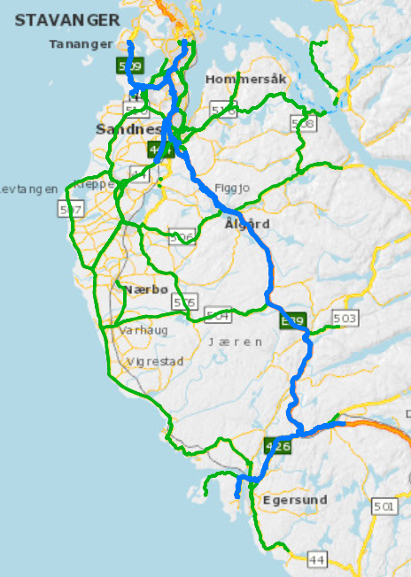
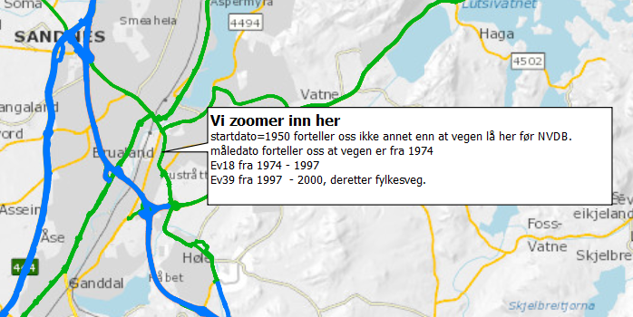
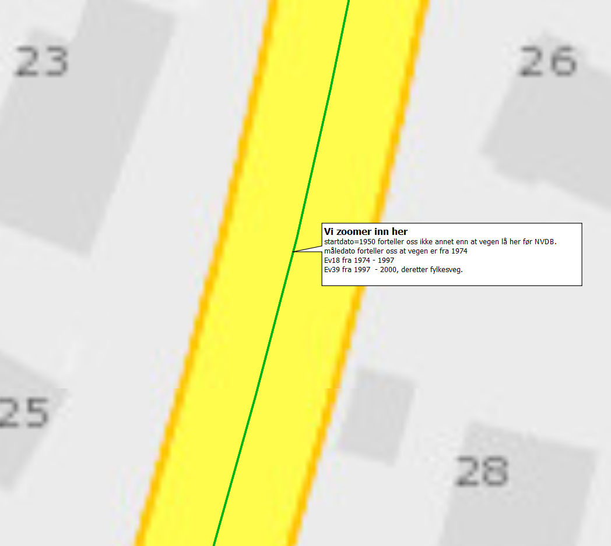
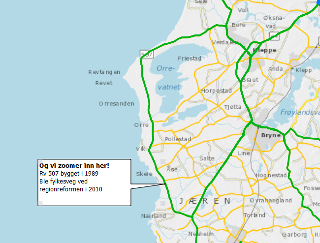
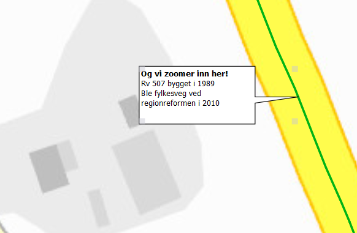
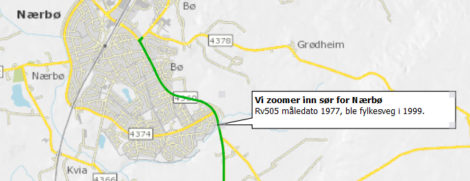

# Demo, hent historisk vegreferanse 

Demonstrasjon av hvordan du kan hente historiske data / tidsutvikling. Eksemplet bruker data for Jæren. 


Data per 16.04.2021 situasjon er lagret i fila **[dagens_riksveger.zip](https://github.com/LtGlahn/workinprogress/raw/historisk-riksveg/dagens_riksveger.zip)**. Fila er i [geopackage-format](https://www.geopackage.org/), som kan leses av de fleste moderne kartsystemer. 

# Historiske data 

Ting blir mer interessant når vi henter ut historiske data. I kartet under er dagens europa- og riksveg tegnet med blått, og de vegene som en gang har vært riksveg er tegnet med grønt. Mesteparten av de grønne er riksveger som ble fylkesveg ved forvaltningsreformen i 2010. Datasettet finner du [her](https://github.com/LtGlahn/workinprogress/raw/historisk-riksveg/historiske_riksveger.zip)



### Eksempel tidsutvikling: E18 -> E39 -> fylkesveg 

Vi zoomer inn på et punkt ved Sandnes sentrum



_og enda lenger inn. Helt inn!_



Og åpner egenskaptabellen for vegnettet synlig i kart når vi er _*helt*_ innpå: 

| vegnummer | måledato | startdato | sluttdato | kommentar | 
|---|---|---|---|---|
| EV18 | **1974**-01-01 | **1950**-01-01 | 1989-08-23 | E18 ble sannsynligvis bygget her i 1974 | 
| EV18 | 1974-01-01 | 1989-08-23 | 1990-08-15 |
| EV18 | 1974-01-01 | 1990-08-15 | 1997-05-27 | E18 byttet navn i 1997 | 
| EV39 | 1974-01-01 | **1997**-05-27 | **2000**-09-28 | Fra 97 til 2000 het vegen E39, deretter ble det fylkesveg |

Startdato 1950 kan være når som helst før NVDB ble operasjonell, cirka 2006 eller deromkring. **Måledato** forteller oss at vegen ble innmålt i 1974. Dette er trolig byggeår - det er jo naturlig å måle inn vegen mens den bygges, men for å være skråsikker bør man bekrefte dette med andre kilder. Vegen het E18 fra byggeår og fram til 1997, da vi byttet navn til E39. Og i år 2000 bygget vi ny E39 lengre vest, denne her ble da fylkesveg. 

> 'v' - en i Ev18 og Ev39 betyr _veg som er del av operativt vegnett_ . Denne 'v' - en pleier vi utelate når vi snakker om europaveger (E18, E39), men vi pleier ta den med når vi snakker om fylkesveger og riksveger (Fv44, Rv)

### Eksempel tidsutvikling - riksveg på Jæren blir fylkesveg 

Vi gjentar øvelsen på en annen veg utpå jæren: 



__helt inn__




| vegnummer | måledato | startdato | sluttdato | kommentar | 
|---|---|---|---|---|
| RV507  | **1977**-01-01 | 1950-01-01 | 1989-07-17 | Innmålt 1977, dette er trolig byggeår? |
| RV507  | 1977-01-01 | 1989-07-17 | **2010**-01-01 | Ble fylkesveg ved regionreformen 2010 | 

### Gamle Rv505 sør for Nærbø

Siste gang: Vi zoomer inn sør for Nærbø 




| vegnummer | måledato | startdato | sluttdato | kommentar | 
|---|---|---|---|---|
| RV505 | 1977-01-01 | 1950-01-01 | 1999-01-01 | Innmålt 1977, ble fylkesveg i 1999 | 

# Første historikkbrudd - forvaltningsreformen 2010

Mange tusen kilometer med riksveg ble i 2010 overført fra staten til fylkeskommunen gjennom forvaltningsreformen i 2010.

NVDB ble operasjonell cirka 2006, men de eldste dataene i NVDB er hentet fra den enda eldre _*vegdatabanken*_, etablert i 1987. 

# Andre historikkbrudd - regionreformen 2020

Vi måtte gjøre drastiske endringer i NVDB-systemet ved forvaltningsreformen i 2020. Da gikk vi fra 19 til 11 fylker, og det gamle vegreferansesystemet - med fylkesnummer - ble dermed ubrukelig, og vi måtte lage et nytt. Du kan lese litt om overgang fra gammelt til nytt vegreferansesystem [her](https://www.vegvesen.no/fag/teknologi/nasjonal+vegdatabank/vegreferansesystem) og [her](https://www.vegdata.no/ofte-stilte-sporsmal/hva-ma-jeg-vite-om-vegsystemreferanse/). Vi har også laget [oversettelse mellom gammelt og nytt system](https://www.vegdata.no/ofte-stilte-sporsmal/oversette-mellom-ny-og-gammel-vegreferanse/).

Vi tok i bruk det nye vegreferansesystemet i november 2019. Det gamle systemet lever fremdeles parallelt med det nye frem til [august 2021](https://www.vegdata.no/info-utfasing-nvdb-klassisk/), slik som vist i [vegkart klassis](https://vegkart-2019.atlas.vegvesen.no/). Uttak av vegnettsdata med sluttdato før november 2019 gir litt mangelfulle data, blant annet mangler du informasjon om trafikantgruppe. Dermed er det vrient å skille mellom veg for kjørende (trafikantgruppe K) og gående/syklende (trafikantgruppe G). De eldste dataene vil heller ikke være metrert etter det nye systemet. 

Hvis gamle data for trafikantgruppe eller metrering er relevant må du hente ut data for objekttypen [532 vegreferanse](https://datakatalogen.vegdata.no/532-Vegreferanse). Vi håper å lage eksempel på en slik analyse snart. 

# Filtrere på start- og sluttdato 

I dette datasettet har vi lagt til rette for en enkel datofiltering som bør fungere i de fleste systemer. Start- og sluttdato er lagret som  et heltall mellom 19500101 og 99991231 i variablene (kolonnene) `stardato_num, sluttdato_num`. Dermed kan du bruke operatorene _mindre enn_ eller _strørre enn_ for å filtrere datasettet (dvs >, <, >= og <=). 

For å få det vegnettet som er gyldig i dag kan du f.eks. gjøre slik: 

```
historisk_e_r.sluttdato_num > 20210416 
```

For å få det vegnettet som var gyldig like før regionreformen i 2010: 

```
historis_e_r.startdato <= 20091231 AND historisk_e_r.sluttdato > 20091231
```
Merk at i NVDB er konvensjonen [gyldig fra og med, gyldig til>, dvs ikke "til og med". Derfor >= operatoren på startdato. 

# Innstallasjon og kjøring

For å kjøre dette programmet må du ha python med geopandas installert. Vår soleklare anbefaling er [anaconda sin python-installasjon](https://www.anaconda.com), følg "download" lenkene der. Så installerer du geopandas kjapt og greit med 

```bash
conda install geopandas
```

Så må du hente [dette biblioteket](https://github.com/LtGlahn/nvdbapi-V3) og lagre det lokalt. PRO-tip: editer fila **starther** slik at mappen for nvdbapi-V3 havner på python søkestien din. 


Deretter er du klar til å kjøre python-scriptet `hentrv.py` 

# Todo 

Eksempel på analyse av historiske objekter 532 vegreferanse.