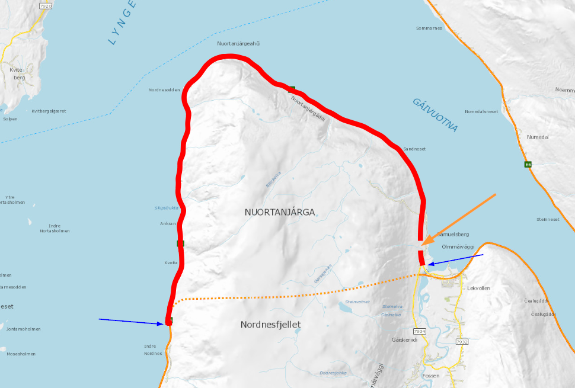

# Mangelrapport 

Koden her analyserer en sql-dump fra NVDB databasen som viser hvor det mangler bruksklasse normaltransport (objekttype [904](https://datakatalogen.vegdata.no/904-Bruksklasse,%20normaltransport)) i NVDB. Vi leser inn filen `checkCoverage_904_ERF_VT_K_-ferje.log` med scriptet `mangelrapport.py`. 

Denne sql-dumpen ser slik ut: 

```
Nasjonal vegdatabank- PRODUKSJON          2021-11-15 09.04

Oversikt over veglenker som ikke er fullt dekket av objekttype 904 (vegkat ERF, fase VT, trafikantgr K, vegtype -ferje)

PL/SQL procedure successfully completed.


       NID      MSLOC      MELOC     LENGTH VREF
---------- ---------- ---------- ---------- ----------------------------------------
     21765  .36944962  .41532587    357.843 4221 PV98455 S1D1 seq=1000 (K)
     21802  .82250887  .82254903       .153 FV403 S2D1 seq=19000 (K)
     21855  .32732901  .32739168       .218 FV420 S4D1 seq=2000 (K)
```
Python-scriptet leser de øverste linjene med hvilket driftsmiljø dette er hentet fra, dato, klokkeslett og den tekstlige beskrivelsen (Oversikt over veglenker...). For hver eneste rad henter vi vegnett fra NVDB api LES med en av disse to metodene: 
  * Rute fra endepunktet `/beta/vegnett/rute` [dokumentasjon](https://nvdbapiles-v3.atlas.vegvesen.no/dokumentasjon/openapi/#/Vegnett/get_beta_vegnett_rute) 
  * Hvis søket etter rute feiler så henter vi veglenkesekvens ID  fra endepunktet `/vegnett/veglenkesekvenser/segmentert/`  [dokumentasjon](https://nvdbapiles-v3.atlas.vegvesen.no) og tar med de vegsegmentene der start- og sluttposisjoner overlapper med sql-raden. 

Kolonne `NID`, `MSLOC` og `MELOC` inneholder hhv veglenkesekvens ID, start- og sluttposisjon som brukes i disse to søkene. Av 426 rader så feiler 38 rutesøk. Data lagres til excel og GIS-formatet [geopackage](https://www.geopackage.org/). Før lagring til excel blir data sortert etter trafikantgruppe (K øverst) og lengden (sqldump_length)

Her er den lengste dataraden, nesten ei mil med E6. Når vi først får vist strekningen i kartet så ser vi kjapt at denne delen av vegnettet er ikke lenger i bruk. I tillegg er det et brudd (orange pil), så det er ikke så rart at rutesøket feiler. Start- og stopp for rutesøket er markert med blå pil. 



Jeg har kun sjekket de seks lengste strekningen fra sql-dumpen. Det var en god blanding av reelle feil, vegnett som er gått ut av bruk og falske positive. 