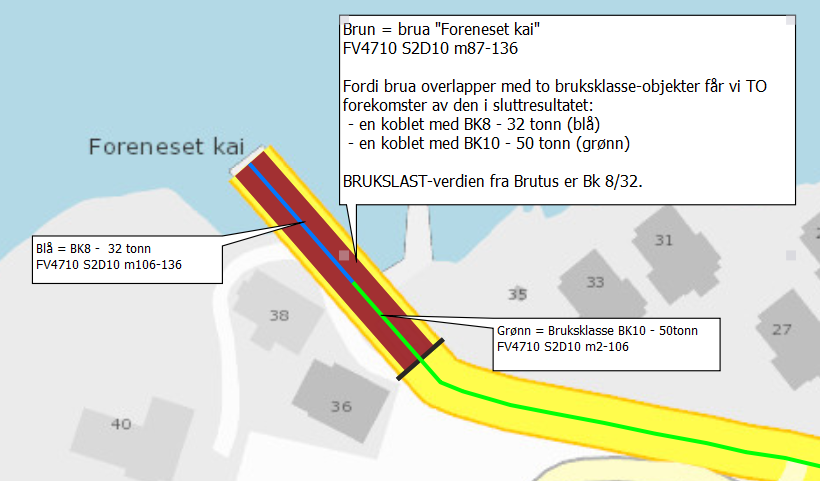
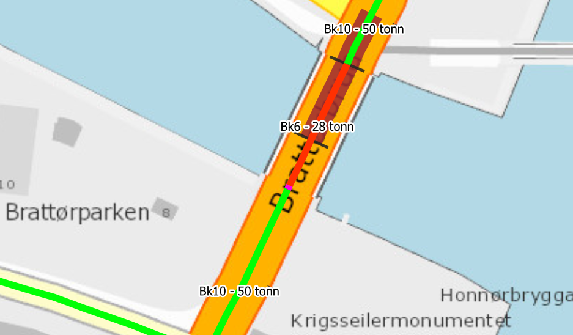
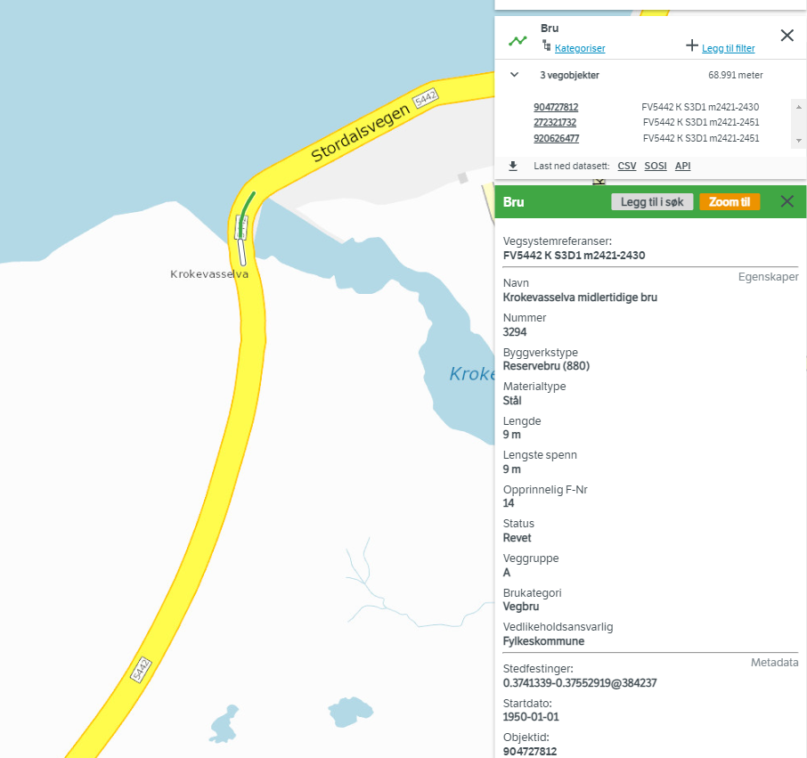

# Datadump fra Brutus 

Den første datadumpen hadde ikke med alle detaljer om "beliggenhet, hvilket gjorde den ubrukelig. 

Verdiområder, "BELIGGENHET": 

| BELIGGHENHET | Jans tolking  | Kommentar | Antall | 
|---|---|---|---|
| P  | På? | Dem vi vil ha - det vegnettet brua gjelder for | 21116 |
| O | Over? | Brua går **over** vegen det vises til | 5175 |
| L | Langs? | Bruka går **langs** (parallelt med) vegen det vises til | 1736 |

For våre formål er vi kun interessert i oppføringer med verdien _Beliggenhet = P_, og filtrerer derfor på det. 

Se detaljene i 

# Kobling mot bruksklasse 

Vi tar ut brudata fra NVDB og kobler med de objektene _905 Bruksklasse, uoffisiell_ som overlapper, basert på veglenkeposisjon. Merk at vi jobber med objektenes vegsegmenter. Hvert objekt kan ha mange segmenter. Og hvert bru-vegsegment kan overlappe med null, ett eller flere bruksklasse-vegsegmenter. 

> Vi gjør altså ingen **segmentering** av bruobjekter og bruksklasse: Vi finner overlapp. Og overlapp kan ha null, ett eller mange treff. 

Eksemplene under illustrerer litt av mangfoldet vi dermed får. Samt hvordan upresis stedfesting av bruer (forskjøvet langs veg) gir opphav til en del støy og rusk i datasettet. 

# Ett brusegment overlapper med flere bruksklasse-objekter

Skjermbildet under viser hvordan brua ["Foreneset kai" ](https://vegkart.atlas.vegvesen.no/#valgt:276199640:60) (brunt) overlapper med to bruksklasse-objekter (grønt og blått). Dermed blir det to forekomster med identisk utstrekning i sluttresultatene. 

# Skjev plassering av Brattørbrua 

["Brattørbrua" ](https://vegkart.atlas.vegvesen.no/#valgt:272297890:60) (brunt) 
 er delt opp i to vegsegmenter, hhv EV6 S75D140 m233-253 (søndre segment, ute på brua) og EV6 S75D140 m253-266 (nordre segment, inne på land). Som vi ser, er Brattørbrua sin stedfesting på vegnettet skjev, slik at den stikker inn over land på nordsiden, og ikke helt rekker ned til søndre bredde av kanalen. 

Hvert av disse segmentene overlapper med hvert sitt bruksklasse-objekt. Det i sør har BK6 - 28 tonn

BRUKSLAST-verdien fra Brutus er Bk 6/28. Dermed blir det sørligste segmentet flagget som godkjent (fordi data fra bruksklasse-objektet stemmer overens), mens det nordligste segmentet IKKE blir godkjent (BK6/28 er lavere enn BK10/50). Hvis Brattørbrua var mer presist plassert i NVDB ville vi unngått dette. 

# Bør filtere ut nedlagte og planlagte bruer 

[Krokevasselva](https://vegkart.atlas.vegvesen.no/#valgt:272321732:60) FV5442 S3D1 m2421-2451 deler plassering med ei nedlagt (midlertidig) bru og ei planlagt bru. Både Brutus, vegkart og NVDB api viser alle tre. 

I vår analyse burde vi såklart filtrert på trafikerte bruer. Dette får komme som en senere forbedring. 

