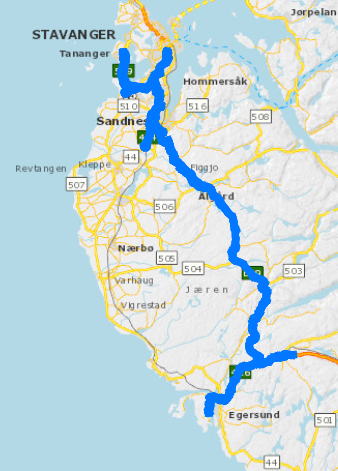

# Demo, analyser historisk vegnett via objekttype 532 vegreferanse

Demonstrasjon av hvordan du kan hente historiske data / tidsutvikling. Eksemplet bruker data for Jæren. 



se [analyse av vegnett](./README.md) for analyse av historisk vegnett. Dette er enklere enn analyse av 532 vegreferanse, og fungerer veldig bra for endringer etter november 2019, da vi tok i bruk det nye vegreferansesystemet. 

For endringer før november 2019 blir noen av analysene ufullstendige. For eksempel mangler data om trafikantgruppe for endringer før november 2019. Da er det vanskelig å skille mellom gang/sykkelveger og vanlige bilveger. Heldigvis kan analyse av 532 vegreferanse kaste lys over problemet. 

# Nedlasting av data

For [nedlasting av vegnett](https://nvdbapiles-v3.atlas.vegvesen.no/dokumentasjon/openapi/#/Vegnett/get_vegnett_veglenkesekvenser_segmentert) har vi en fin `historisk` - parameter. Ved å sette `historisk=true` får vi all historikk for veglenkeskvenser i NVDB, innafor de andre søkeparametrene du har satt. 

Vi har ingen tilsvarende `historisk` - parameter for [nedlasting av vegobjekter)](https://nvdbapiles-v3.atlas.vegvesen.no/dokumentasjon/openapi/#/Vegobjekter/get_vegobjekter__vegobjekttypeid_). Den eneste historikkfunksjonen som er tilgjengelig er `tidspunkt=<en konkret dato>`. Vårt hack blir da å laste ned data for hvert år fra 2004 til i dag. Dette er ineffektivt og gjør at vi etterpå må rydde vekk dubletter  (dvs hvis et vegobjekt var gyldig uten endringer i både 2004 og 2005 så kommer dette vegobjektet to ganger). 

# Metode 

1. Fra [NVDB api](https://nvdbapiles-v3.atlas.vegvesen.no/dokumentasjon/openapi/#/Vegobjekter/get_vegobjekter__vegobjekttypeid_) laster du ned vegobjekter av typen [532 Vegreferanse](https://datakatalogen.vegdata.no/532-Vegreferanse) innafor søkekriterinene: 
    * innafor valgt kartutsnitt
    * Med egenskapfilter Vegkategori = Europaveg, Riksveg eller Fylkesveg `egenskap='4566=5492 OR 4566=5493 OR 4566=5494'`
    * For hvert `tidspunkt=`nyttårsdag for årene 2004 til i dag, pluss `2009-12-31` (dagen før forvaltningsreform 2010)
1. Fjern dubletter basert på egenskapene `nvdbId, versjon, veglenkesekvensid, startposisjon, sluttposisjon`. 

# Historiske data: Start og sluttdato


**Startdato 1950-01-01** har ingenting med vegutbygging å gjøre - den forteller kun at data om denne vegen eller objektet er eldre enn NVDB.  **Måledato** kan fortelle oss når vegen ble innmålt - når egenskapen finnes. Måledato er trolig enten byggeår (hvis vegen ble innmålt med landmålerutstyr så er det jo naturlig å måle inn vegen mens den bygges. Men vegen kan også være innmålt fra flyfoto. For å være skråsikker bør man bekrefte dette med andre kilder.

# Første historikkbrudd - forvaltningsreformen 2010

Mange tusen kilometer med riksveg ble i 2010 overført fra staten til fylkeskommunen gjennom forvaltningsreformen i 2010.

# Andre historikkbrudd - regionreformen 2020

Vi måtte gjøre drastiske endringer i NVDB-systemet ved forvaltningsreformen i 2020. Da gikk vi fra 19 til 11 fylker, og det gamle vegreferansesystemet - med fylkesnummer - ble dermed ubrukelig, og vi måtte lage et nytt. Du kan lese litt om overgang fra gammelt til nytt vegreferansesystem [her](https://www.vegvesen.no/fag/teknologi/nasjonal+vegdatabank/vegreferansesystem) og [her](https://www.vegdata.no/ofte-stilte-sporsmal/hva-ma-jeg-vite-om-vegsystemreferanse/). Vi har også laget [oversettelse mellom gammelt og nytt system](https://www.vegdata.no/ofte-stilte-sporsmal/oversette-mellom-ny-og-gammel-vegreferanse/).

Vi tok i bruk det nye vegreferansesystemet i november 2019. Det gamle systemet lever fremdeles parallelt med det nye frem til [august 2021](https://www.vegdata.no/info-utfasing-nvdb-klassisk/), slik som vist i [vegkart klassis](https://vegkart-2019.atlas.vegvesen.no/). Uttak av vegnettsdata med sluttdato før november 2019 gir litt mangelfulle data, blant annet mangler du informasjon om trafikantgruppe. Dermed er det vrient å skille mellom veg for kjørende (trafikantgruppe K) og gående/syklende (trafikantgruppe G). De eldste dataene vil heller ikke være metrert etter det nye systemet. 

Hvis gamle data for trafikantgruppe eller metrering er relevant må du hente ut data for objekttypen [532 vegreferanse](https://datakatalogen.vegdata.no/532-Vegreferanse). 

# Tredje historikkbrudd kommer i august 

Etter planen slutter vi å vedlikeholde det gamle vegreferanseobjektet (dvs objekttype 532 vegreferanse) i august 2021. Den analysen her kan dermed ikke anvendes på data nyere enn august 2021. 

# Filtrere på start- og sluttdato 

I dette datasettet har vi lagt til rette for en enkel datofiltering som bør fungere i de fleste systemer. Start- og sluttdato er lagret som  et heltall mellom 19500101 og 99991231 i variablene (kolonnene) `stardato_num, sluttdato_num`. Dermed kan du bruke operatorene _mindre enn_ eller _strørre enn_ for å filtrere datasettet (dvs >, <, >= og <=). Tallet 99991231 erstatter såkalt _**åpen sluttdato**_, som er det normale for objekter gyldige i dag. 

For å få det vegnettet som er gyldig i dag kan du f.eks. gjøre slik: 

```
historisk_e_r.sluttdato_num > 20210416 
```

For å få det vegnettet som var gyldig like før regionreformen i 2010: 

```
historis_e_r.startdato <= 20091231 AND historisk_e_r.sluttdato > 20091231
```
Merk at i NVDB er konvensjonen [gyldig fra og med, gyldig til>, dvs ikke "til og med". Derfor >= operatoren på startdato. 

# Innstallasjon og kjøring

For å kjøre dette programmet må du ha python med geopandas installert. Vår soleklare anbefaling er [anaconda sin python-installasjon](https://www.anaconda.com), følg "download" lenkene der. Så installerer du geopandas kjapt og greit med 

```bash
conda install geopandas
```

Så må du hente [dette biblioteket](https://github.com/LtGlahn/nvdbapi-V3) og lagre det lokalt. PRO-tip: editer fila **starther** slik at mappen for nvdbapi-V3 havner på python søkestien din. 


Deretter er du klar til å kjøre python-scriptet `hentrv532.py` 
