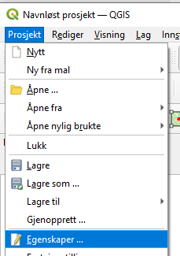
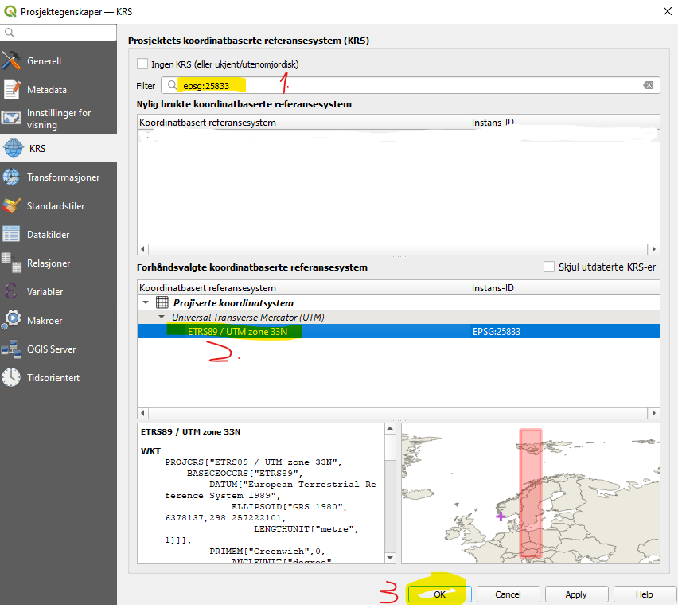

# Installasjon og konfigurering

På PC der dere har admin-rettigheter skal det være grei skuring å installere diverse open source programvare. Se [installasjon](./installasjon.md)


## Python ["individual edition"](https://www.anaconda.com/products/individual) fra Anaconda 

https://www.anaconda.com/products/individual

#### Opprett nytt "environment" 

Vi ønsker selvsagt å bruke nyeste versjon av GIS-programvaren. Conda har gjort en fantastisk jobb med å tilby MASSE god programvare i distribusjonslister kalt "channel". Standard "channel" henger typisk litt etter på GIS-programvare (men er mer gjennomtestet, og har litt mindre risiko for versjonskonflikter. Men versjonskonflikter er uansett ikke noe problem for oss; hele grunnen til å lage separate "environments" er jo å isolere en sandkasse med akkurat den programvaren vi trenger.)

Distribusjonslisten vi ønsker å bruke heter `conda-forge`. 

**Enklest oppskrift**: Etter å ha prøvd ut _Anaconda navigator_ vil jeg påstå det enkleste er å kjøre disse kommandoene i terminalvindu. Start `Anaconda prompt`via Start-menyen. Kopier og lim inn en linje av gangen. Merk at den tredje conda-kommandoen er laaaaaaang, pass på at den ikke brytes med linjeskift før du limer den inn. 

```
conda config --add channels conda-forge
conda config --set channel_priority strict
conda create -n kulegeoting bokeh cartopy dask fiona geojson geopandas geoviews geoviews-core holoviews hvplot numpy openpyxl pandas pandoc pandocfilters postgresql proj pyproj shapely xlrd xlsxwriter xmltodict ipykernel ipympl nb_conda_kernels nodejs
```


> Pro-tip: Et høyreklikk i terminalvindu limer inn den teksten som finnes på utklippstavla. 


**Med Conda Navigator**. Oppskriften for å legge til riktig "channel" (conda forge distribusjonsliste) står helt nederst her: https://conda-forge.org/docs/user/introduction.html#display-conda-forge-packages-in-anaconda-navigator . Lengre opp på samme side står generelle tips om "anaconda navigator". I prinsippet skal det bare være å klikke seg gjennom, og dernest følge oppskriften for _Create environment_ og så installere hvert av programmene på listen over. 


Terskelverdier: Fant 123 krumningsradious og 6.6% stigning, 
500 bufferradius, 180 meters krumningsradius og 6.6% stigning. 

### Jans bibliotek for å lese NVDB-data 

Last ned https://github.com/ltglahn/nvdbapi-v3 (og pakk ut, dersom du bruker "download zip-file" metoden). 

> Pro-tip: Å introdusere dere for arbeidsflyt i git blir litt "over the top", men for dem som vil installere git-programvare er det [masse gøy å velge i](https://git-scm.com/downloads), fra kommandolinjeverktøy til pek-og-klikk. "Git clone" er metoden for å laste ned reposet mit. 

Dette biblioteket har også en qgis-integrasjon, se under. 

###  Qgis 

Siste qgis-versjon lastes ned fra https://www.qgis.org/en/site/ 

Velg gjerne `Qgis Standalone installer`, siste versjon. 

Lagre et såkalt "prosjekt" i QGIS. I QGIS-verdenen er et prosjekt en samling med kartlag, data og tegneregler. Velg **Prosjekt -> Nytt**. Deretter klikker du **Prosjekt -> Egenskaper** 



Velg KRS-fanen (klikk i venstre marg). Deretter 
1. Skriv `epsg:25833` i søkefeltet
1. Velg projeksjonen `epsg:25833` i listen over projeksjoner (feltet midt på)
1. Klikk OK

Legg så til kartbakgrunn: **Lag -> Legg til Lag 




Jans python-bibliotek har også en qgis-integrasjon der man kan bruke python-kommandoer for å laste ned data direkte fra NVDB api. Se beskrivelse her: https://github.com/LtGlahn/nvdbapi-V3/blob/master/README_qgis.md 


